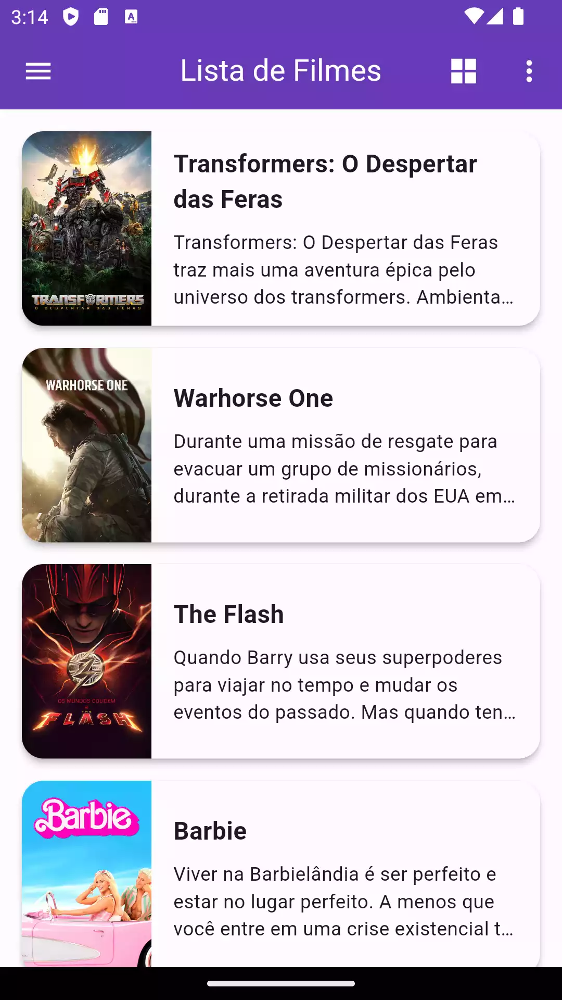
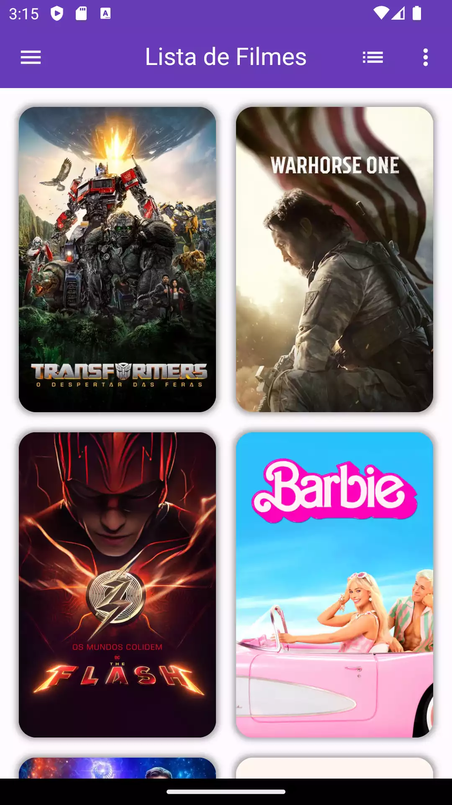
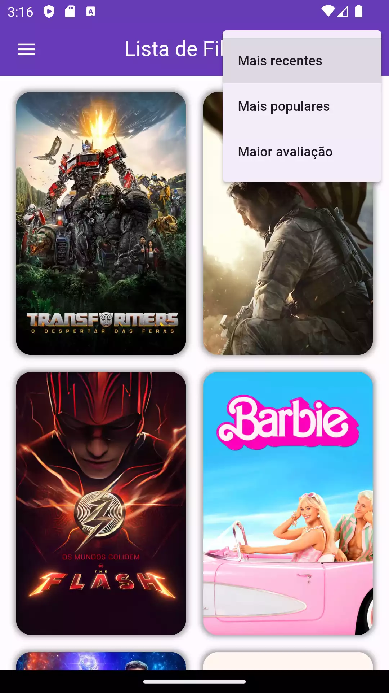

# Trabalho final flutter

_1MOBR / APLICAÇÕES NATIVAS CROSS-PLATFORM COM FLUTTER / MARCELO PINHEIRO MONTANHER_

## Lista de tarefas

- [x] (2pts) Tela de Login e Cadastro separadas. O app deve ter uma tela de Splash também, nessa
  tela deve ser verificado se o usuário já realizou o login, caso já tenha feito o login,
  redirecionar diretamente para a home da aplicação
- [x] (2pts) Integração com banco de dados do Firebase ou consumo de alguma API (pode ser os dois).
- [x] (1pt) Presença de listagem de informações (ListView)
- [x] (1pt) Documentação com informações gerais sobre a aplicação, objetivo do projeto, layout,
  instruções para testar o projeto (se necessário)
- [x] (2pts) Arquitetura: Separação de camadas, utilização do Bloc/Cubit
- [ ] (2pts) Qualidade do app, pontos de vista do usuário final

## Descrição do projeto

O projeto consiste em um aplicativo com recursos de login utilizando o Firebase para autenticação.
Os usuários poderão realizar o login e, após autenticados, poderão salvar seus filmes favoritos e
visualizar informações de perfil personalizadas. O app também utiliza a API The Movie DB para listar
filmes e mostrar detalhes sobre cada filme.

## Instruções para Testar o Projeto

Para testar o projeto, siga os passos abaixo:

1. Verifique se o Flutter e Dart estão configurados em seu ambiente e IDE.
2. Clone o projeto e abra-o em sua IDE.
3. Execute o comando `pub get` para baixar todas as dependências necessárias.
4. Antes de prosseguir, crie um arquivo dentro da pasta `core/utils` chamado `settings.dart`
   seguindo o modelo abaixo:

### Descrição do arquivo settings.dart

```dart
class Settings {
  static String movieDbApiKey = "SUA APIKEY";
  static String movieDbBaseUrl = "https://api.themoviedb.org/3";
  static String movieDbImagesUrl = "https://image.tmdb.org/t/p/w500";
  static String movieDbLanguage = "pt-BR";
  static String movieDbRegion = "BR";
  static String movieDbToken = "TOKEN";
}
```

Certifique-se de substituir "SUA APIKEY" e "TOKEN" pelas chaves de acesso corretas fornecidas pela
API The Movie DB

## Demonstração

|       Splash com usuário salvo        |               Tela de login               |               Tela de Cadastro               |
|:-------------------------------------:|:-----------------------------------------:|:--------------------------------------------:|
|  |  |  |

|                     Home                     |                  Home modo 2                  |                Home filtros                 |
|:--------------------------------------------:|:---------------------------------------------:|:-------------------------------------------:|
|  |  |  |

|                Detalhes                 |          Detalhe Favoritar          |                Lista favoritos                 |
|:---------------------------------------:|:-----------------------------------:|:----------------------------------------------:|
|  |  |  |
